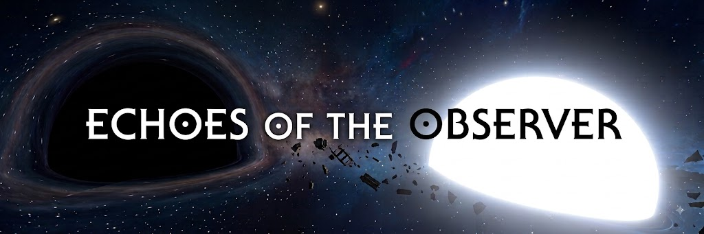

# Echoes of the Observer

A story mod for *Outer Wilds*, created by Known-Mouse for the Summer 2026 Outer Wilds Mod Jam.

143 Billion years into a new universe, you are still a little blue fish living in the mines.

There, you encounter the Nomai and share your memories with Daz. 

After witnessing the clan’s doomed future, Daz decides to work with you to save them.

The Nomai construct new equipment that allows you to launch black and white holes, and even revive yourself at any moment.

But you have only 17 minutes.

Master the new equipment, devise a plan, and save the Nomai!

## Requirements

- Outer Wilds
- [Outer Wilds Mod Loader (OWML)](https://owml.outerwildsmods.com/) (V0.15.6)
- [New Horizons](https://outerwildsmods.com/mods/newhorizons/) (V1.29.5)

## Installation

Install the mod through the Outer Wilds Mod Manager after it has been added to the mod database.

For a manual installation, extract the release archive into the OWML `Mods` directory. The installed mod folder must contain `manifest.json` and `Return.dll` at its top level.

## Languages

- English
- Simplified Chinese

The mod automatically uses the language selected in the game.

## Playing

Start a new expedition from the main menu and follow the on-screen prompts.

The game may briefly stutter while scenes are being initialized. This is normal, so please be patient. If the screen remains black, press the button you normally use to confirm menu selections or advance dialogue.

Using an existing profile is supported, but backing up your Outer Wilds save before installing any story mod is always recommended.

If the beginning leaves you confused, try giving the little four-eyed blue fish a cuddle.

## Credits and License

- Design, story, implementation: Known-Mouse
- Built with OWML and New Horizons
- *Outer Wilds* and its original assets belong to Mobius Digital and their respective rights holders

The source code in this repository is licensed under the MIT License. This repository does not grant any additional rights to assets originating from *Outer Wilds*.
